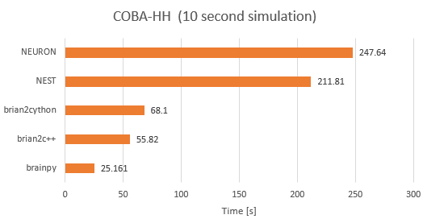

             

**Note**: *BrainPy is a project under development. More features are coming soon. Contributions are welcome.*

## Why to use BrainPy

``BrainPy`` is a lightweight framework based on the latest Just-In-Time (JIT) compilers (especially [Numba](https://numba.pydata.org/)). The goal of ``BrainPy`` is to provide a unified simulation and analysis framework for neuronal dynamics with the feature of high flexibility and efficiency. BrainPy is flexible because it endows the users with the fully data/logic flow control. BrainPy is efficient because it supports JIT acceleration on CPUs (see the following comparison figure. In future, we will support JIT acceleration on GPUs).

## Installation

Install ``BrainPy`` using ``conda``::

    > conda install brainpy -c brainpy

Install ``BrainPy`` using ``pip``::

    > pip install git+https://github.com/PKU-NIP-Lab/BrainPy

The following packages need to be installed to use ``BrainPy``:

- Python >= 3.7
- NumPy >= 1.13
- Sympy >= 1.2
- Matplotlib >= 3.0
- Numba >= 0.50.0

## Neurodynamics simulation

<table border="0">
    <tr>
        <td border="0" width="30%">
            
        </td>
        <td border="0" valign="top">
            <h3><a href="examples/neurons/HH_model.py">HH Neuron Model</a></h3>
            
The Hodgkin–Huxley model, or conductance-based model,
            is a mathematical model that describes how action potentials
            in neurons are initiated and propagated. It is a set of nonlinear
            differential equations that approximates the electrical characteristics
            of excitable cells such as neurons and cardiac myocytes.

        </td>
    </tr>
    <tr>
        <td border="0" width="30%">
            
        </td>
        <td border="0" valign="top">
            <h3><a href="examples/synapses/AMPA.py">AMPA Synapse Model</a></h3>
            
AMPA synapse model.

        </td>
    </tr>
    <tr>
        <td border="0" width="30%">
            
        </td>
        <td border="0" valign="top">
            <h3><a href="examples/networks/gamma_oscillation.py">Gamma Oscillation Model</a></h3>
            
Implementation of the paper: <i> Wang, Xiao-Jing, and György Buzsáki. “Gamma oscillation by
                  synaptic inhibition in a hippocampal interneuronal network
                  model.” Journal of neuroscience 16.20 (1996): 6402-6413. </i>
            

        </td>
    </tr>
    <tr>
        <td border="0" width="30%">
            
        </td>
        <td border="0" valign="top">
            <h3><a href="examples/networks/EI_balance_network.py">E/I Balance Network</a></h3>
        </td>
    </tr>
    <tr>
        <td border="0" width="30%">
            
        </td>
        <td border="0" valign="top">
            <h3><a href="examples/networks/CANN_1D.py">Continuous-attractor Network</a></h3>
            
Implementation of the paper: <i> Si Wu, Kosuke Hamaguchi, and Shun-ichi Amari. "Dynamics and
                    computation of continuous attractors." Neural
                    computation 20.4 (2008): 994-1025. </i>
            

        </td>
    </tr>
</table>

More neuron examples please see [examples/neurons](https://github.com/PKU-NIP-Lab/BrainPy/tree/master/examples/neurons);

More synapse examples please see [examples/synapses](https://github.com/PKU-NIP-Lab/BrainPy/tree/master/examples/synapses);

More network examples please see [examples/networks](https://github.com/PKU-NIP-Lab/BrainPy/tree/master/examples/networks).

## Neurodynamics analysis

<table border="0">
    <tr>
        <td border="0" width="30%">
            
        </td>
        <td border="0" valign="top">
            <h3><a href="examples/dynamics_analysis/NaK_model_analysis.py">Phase Plane Analysis</a></h3>
            
Phase plane analysis of the INa,p+-IK model, where
            "input" is 50., and "Vn_half" is -45..

        </td>
    </tr>
    <tr>
        <td border="0" width="30%">
            
        </td>
        <td border="0" valign="top">
            <h3><a href="examples/dynamics_analysis/NaK_model_analysis.py">
                Codimension 1 Bifurcation Analysis (1)</a></h3>
            
Codimension 1 bifurcation analysis of the INa,p+-IK model,
                in which "input" is varied in [0., 50.].

        </td>
    </tr>
    <tr>
        <td border="0" width="30%">
            
        </td>
        <td border="0" valign="top">
            <h3><a href="examples/dynamics_analysis/NaK_model_analysis.py">
                Codimension 2 Bifurcation Analysis (1)</a></h3>
            
Codimension 2 bifurcation analysis of a two-variable neuron model:
                the INa,p+-IK model, in which "input" is varied
                in [0., 50.], and "Vn_half" is varied in [-50, -40].

        </td>
    </tr>
    <tr>
        <td border="0" width="30%">
            
        </td>
        <td border="0" valign="top">
            <h3><a href="examples/dynamics_analysis/FitzHugh_Nagumo_analysis.py">
                Codimension 1 Bifurcation Analysis (2)</a></h3>
            
Codimension 1 bifurcation analysis of FitzHugh Nagumo model, in which
                "a" is equal to 0.7, and "Iext" is varied in [0., 1.].

        </td>
    </tr>
    <tr>
        <td border="0" width="30%">
            
        </td>
        <td border="0" valign="top">
            <h3><a href="examples/dynamics_analysis/FitzHugh_Nagumo_analysis.py">
                Codimension 2 Bifurcation Analysis (2)</a></h3>
            
Codimension 2 bifurcation analysis of FitzHugh Nagumo model, in which "a"
               is varied in [0.5, 1.0], and "Iext" is varied in [0., 1.].

        </td>
    </tr>
</table>

More examples please see [examples/dynamics_analysis](https://github.com/PKU-NIP-Lab/BrainPy/tree/master/examples/dynamics_analysis).

